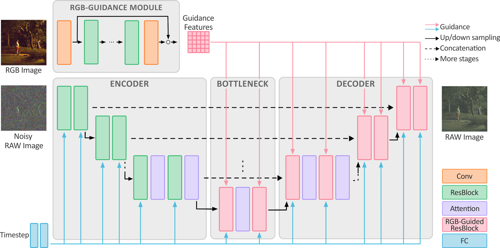

# RAW-Diffusion: RGB-Guided Diffusion Models for High-Fidelity RAW Image Generation

> RAW-Diffusion: RGB-Guided Diffusion Models for High-Fidelity RAW Image Generation  
> Christoph Reinders, Radu Berdan, Beril Besbinar, Junji Otsuka, and Daisuke Iso

Official implementation of the paper "RAW-Diffusion: RGB-Guided Diffusion Models for High-Fidelity RAW Image Generation" [WACV 2025].

## Overview

> **Abstract:** Current deep learning approaches in computer vision primarily focus on RGB data sacrificing information. In contrast, RAW images offer richer representation, which is crucial for precise recognition, particularly in challenging conditions like low-light environments.  The resultant demand for comprehensive RAW image datasets contrasts with the labor-intensive process of creating specific datasets for individual sensors. To address this, we propose a novel diffusion-based method for generating RAW images guided by RGB images. Our approach integrates an RGB-guidance module for feature extraction from RGB inputs, then incorporates these features into the reverse diffusion process with RGB-guided residual blocks across various resolutions.  This approach yields high-fidelity RAW images, enabling the creation of camera-specific RAW datasets. Our RGB2RAW experiments on four DSLR datasets demonstrate state-of-the-art performance. Moreover, RAW-Diffusion demonstrates exceptional data efficiency, achieving remarkable performance with as few as 25 training samples or even fewer. We extend our method to create BDD100K-RAW and Cityscapes-RAW datasets, revealing its effectiveness for object detection in RAW imagery, significantly reducing the amount of required RAW images. 

*Code will follow*